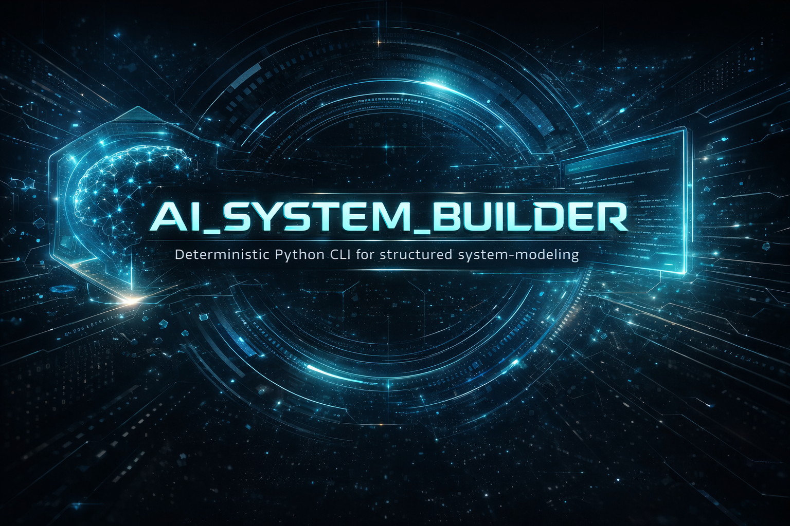

<p align="center">
  
</p>

<h1 align="center">AI_SYSTEM_BUILDER</h1>

<p align="center">
  <strong>A deterministic Python system for building trustworthy workflow engines — one validated layer at a time.</strong>
</p>

<p align="center">
  
  <a href="https://github.com/Cyber-Mario1979/AI_SYSTEM_BUILDER/blob/main/LICENSE"></a>
  <a href="https://github.com/Cyber-Mario1979/AI_SYSTEM_BUILDER/blob/main/ROADMAP_CANONICAL.md"></a>
  <a href="https://github.com/Cyber-Mario1979/AI_SYSTEM_BUILDER/blob/main/README.md#quick-start"></a>
</p>

---

## The core idea

Most workflow systems are built fast and trusted late — if ever.

**AI_SYSTEM_BUILDER** inverts that. It builds trust into every layer from day one:

- **Deterministic before smart** — behavior is explicit and predictable before any automation is layered on top
- **Validated before convenient** — state mutations are controlled and persisted with evidence
- **Governed before expanded** — milestones are closed by acceptance, not by assumption

The result is a workflow engine you can reason about, extend with confidence, and eventually hand off to an AI runtime — because the foundation was designed to hold that weight.

---

## What this project is — and what it is not

### What it is

**AI_SYSTEM_BUILDER** is a roadmap-driven Python system for modeling workflow entities, their relationships, and the validation rules that govern them. It is built to demonstrate that a serious, trustworthy workflow engine can be constructed by a solo builder working in structured cooperation with an AI platform.

The project proves three things simultaneously:

1. That deterministic behavior must be _designed_ — not assumed or retrofitted
2. That milestone governance produces a codebase that can be navigated by anyone, not just its author
3. That a real engineering foundation can be built through human + AI co-building under strict execution discipline

### What it is not

| Not this                       | Because                                                 |
| ------------------------------ | ------------------------------------------------------- |
| A general AI agent framework   | AI behavior is a _future layer_, not the starting point |
| A CQV application              | CQV is the proving ground, not the product identity     |
| A vibe-coded prototype         | Every checkpoint is validated before progression        |
| A free-form automation sandbox | Mutation rules are explicit; nothing happens implicitly |

> **On CQV:** Pharmaceutical commissioning, qualification, and validation was chosen as the test domain precisely because it is demanding, regulated, and unforgiving. When the system holds up under CQV pressure, it holds up everywhere.

---

## Current live boundary

> **Phase 3 — AI Runtime Architecture | Milestone 8 — Multi-Entity Coordination**

| Tracker field               | Current value                                                  |
| --------------------------- | -------------------------------------------------------------- |
| Latest completed checkpoint | M8.5C — Cross-entity validation and failure behavior completed |
| Next unfinished checkpoint  | M8.6 — Minimal orchestration without LLM dependency            |
| Validation status           | `424 passed in 40.53s`                                         |

**Stable capabilities at this boundary:**

- Deterministic task management
- Work Package model with full task association
- Task collections with controlled workflow states
- Deterministic task ↔ collection relationship normalization
- Work Package selector context: type, preset seed, standards bundles, scope/intent
- Binding-context consistency controls for planning surfaces
- Cross-entity read surfaces across Work Packages, collections, tasks, and selector-context visibility
- Cross-entity update rules for collection ↔ Work Package mutation
- Cross-entity validation and fail-closed behavior for conflicting deletes, bound relationship breaks, and plan-referenced destructive mutations
- Planning foundation entities with persisted schedule-consistency validation
- Milestone UAT and closeout governance through all prior milestones

---

## Architecture principles

### 1 — Determinism is a first-class design rule

Command behavior, failure behavior, state mutation rules, and persistence validation are all explicit by design — not emergent, not discovered at runtime.

### 2 — The CLI is an adapter, not the system

Domain logic lives in core modules. The CLI is a thin adapter layer on top. This protects maintainability, future UI readiness, and the ability to layer an orchestrator without rewriting the engine.

### 3 — Progression is governed, not improvised

The repository uses a canonical roadmap, architecture guardrails, a current-position tracker, implementation checkpoints, milestone UAT, and milestone closeout notes. The project has **direction**, not just motion.

### 4 — The goal is trustworthy runtime behavior — not just CRUD

The system now models Work Package workflow structure, collection state concepts, context-aware binding, cross-entity read/update contracts, fail-closed destructive mutation rules, and planning consistency validation. That groundwork exists because the long-term direction is toward controlled AI/runtime orchestration — and that future needs a foundation strong enough to support it.

---

## Implemented capabilities

### State and task layer

```powershell
python -m asbp state init
python -m asbp state show
python -m asbp task add "Prepare FAT" --task-key "prepare-fat"
python -m asbp task list
```

State initialization, inspection, controlled mutation, and deterministic task operations.

---

### Work Package layer

```powershell
python -m asbp wp add WP-001 "Tablet press qualification"
python -m asbp wp list
python -m asbp wp show WP-001
python -m asbp task set-work-package prepare-fat WP-001
python -m asbp wp set-selector-type WP-001 process-equipment
python -m asbp wp set-preset WP-001 oral-solid-dose-standard
python -m asbp wp set-standards-bundles WP-001 automation
python -m asbp wp set-scope-intent WP-001 qualification-only
python -m asbp wp show WP-001 --show-selector-context --show-collection-ids
```

Work Package creation, inspection, update, deletion, filtering, task association, selector-context mutation, and cross-entity visibility into bound collections.

---

### Collection layer

```powershell
python -m asbp collection add "Source Pool"
python -m asbp collection add "Committed Selection" --collection-state committed
python -m asbp collection list --show-work-package-id --show-task-ids
python -m asbp collection show TC-001 --show-work-package-id
python -m asbp collection add-task TC-001 prepare-fat
python -m asbp collection set-work-package TC-001 WP-001
python -m asbp collection clear-work-package TC-001
python -m asbp collection remove-task TC-001 prepare-fat
```

Collection creation, listing, state and title management, controlled task membership, and explicit collection ↔ Work Package mutation surfaces.

---

### Planning foundation layer

Planning foundation logic, persisted schedule-consistency validation, and plan-aware cross-entity protection rules now exist in the core/state-validation layer. This is still not a fully stabilized public CLI planning surface — it is the validated groundwork for what comes next.

---

## Repository layout

```text
asbp/                         Application source
tests/                        Automated validation suite
docs/                         UAT records, closeout notes, supporting artifacts
assets/                       Repository presentation assets
ROADMAP_CANONICAL.md          Canonical direction and checkpoint ladder
PROGRESS_TRACKER.md           Current-position tracker (single source of truth)
ARCHITECTURE_GUARDRAILS.md    Permanent architectural boundary rules
```

---

## Governance model

This repository separates four things that most projects conflate:

| Document                     | Defines                                                                     |
| ---------------------------- | --------------------------------------------------------------------------- |
| `ROADMAP_CANONICAL.md`       | Phase order, milestone order, checkpoint ladder, transition rules           |
| `ARCHITECTURE_GUARDRAILS.md` | Permanent boundaries: CLI as adapter, state access rules, module boundaries |
| Code and tests               | What actually exists, what commands are live, what validations are enforced |
| `PROGRESS_TRACKER.md`        | Latest completed checkpoint, next target, current validation status         |

That separation is what prevents drift. At any point, anyone can open the tracker and know exactly where the project stands.

---

## Acceptance discipline

A milestone is not closed because code exists. It is closed after:

1. Implementation checkpoints are completed
2. Automated validation passes
3. Milestone UAT is conducted and recorded
4. Milestone closeout is explicitly confirmed

This discipline is non-negotiable and is one of the core things that separates this repository from a typical prototype.

---

## Quick start

**1. Create and activate a virtual environment**

```powershell
py -3.14 -m venv .venv
Set-ExecutionPolicy -Scope Process -ExecutionPolicy Bypass
.\.venv\Scripts\Activate.ps1
python --version
```

**2. Run validation**

```powershell
python -m pytest -q
```

**3. Initialize local state**

```powershell
python -m asbp state init
python -m asbp state show
```

**4. Explore the CLI**

```powershell
python -m asbp --help
python -m asbp wp -h
python -m asbp collection -h
python -m asbp task -h
```

---

## What comes next

The next active slice is **M8.6 — Minimal orchestration without LLM dependency**.

Near-term direction continues to strengthen multi-entity coordination, deterministic orchestration behavior, and bounded runtime readiness before any AI writing layer is introduced.

Longer term, the project is intended to support richer workflow execution and controlled AI/runtime orchestration — but only once the underlying deterministic model is strong enough to carry that weight. That sequencing is deliberate, and it will not be rushed.

---

## License

Licensed under the **GNU General Public License v3.0**.  
See `LICENSE` for full terms.
